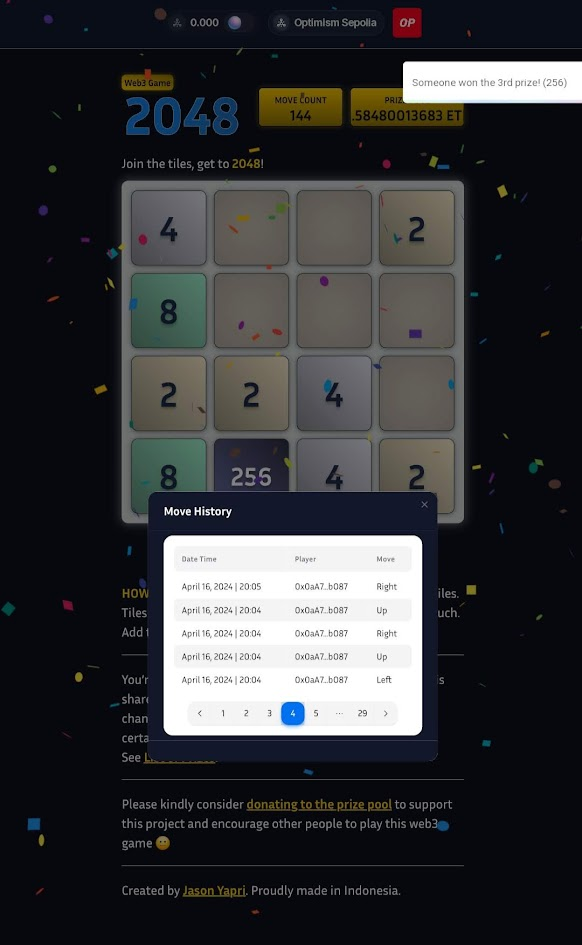
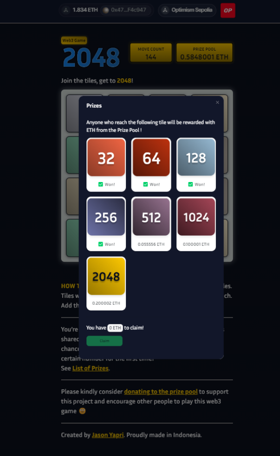

<h1 align="center"> Hi  , I'm <u>Jason Yapri</u> from Indonesia  ! </h1>

<h3> I'm a multidisciplinary Remote Blockchain Engineer equipped with a decade of experience designing and developing Applications. </h3>

I've worked at a remote Web3 startup - developing the backend of Web3 wallet along with setting up, maintaining and scaling blockchain nodes.

I've also been a speaker, instructor and guest lecturer talking about Software Engineering, Blockchain, Web3 and Metaverse in Swiss German University, CMKL University, GOTO Impact Foundation, Saakuru Academy (formerly known as AAG Academy) and Vexanium Blockchain.

<h2> 🤝 Connect with me </h2> 
&nbsp;
&nbsp;

 
 

<h2> 🔥 What I'm working on </h2> 
&nbsp;

<h4>Web3 Implementation of the 2048 Game. It runs on the EVM L2 blockchain: Optimism Sepolia Testnet.</h4>
👉 <a href="https://2048.jasonyapri.com"> Check it out</a> 👈

 
 
 

<h2> 📈 Github Stats </h2> 

<h2> 🛠️ Skills </h2> 
<h3> Smart Contract Development </h3> 
&nbsp;
&nbsp;
&nbsp;
&nbsp;
&nbsp;
&nbsp;
&nbsp;

 

<h3> Programming Languages </h3> 
&nbsp;
&nbsp;
&nbsp;
&nbsp;
&nbsp;
&nbsp;
&nbsp;
&nbsp;
&nbsp;

 

<h3> Database and Containerization </h3> 
&nbsp;
&nbsp;
&nbsp;
&nbsp;

 

<h3> Library, Framework and CMS </h3> 
&nbsp;
&nbsp;
&nbsp;
&nbsp;
&nbsp;
&nbsp;
&nbsp;

 

<h3> Cloud Services & Security </h3> 
&nbsp;
</a>&nbsp;
&nbsp;
&nbsp;
&nbsp;
&nbsp;

 

<h3> CSS Framework & Design </h3> 
&nbsp;
&nbsp;
&nbsp;
&nbsp;